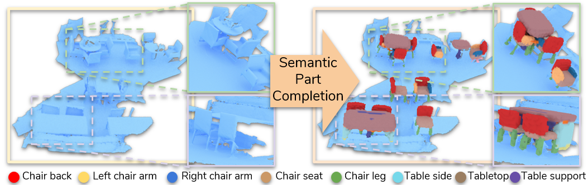
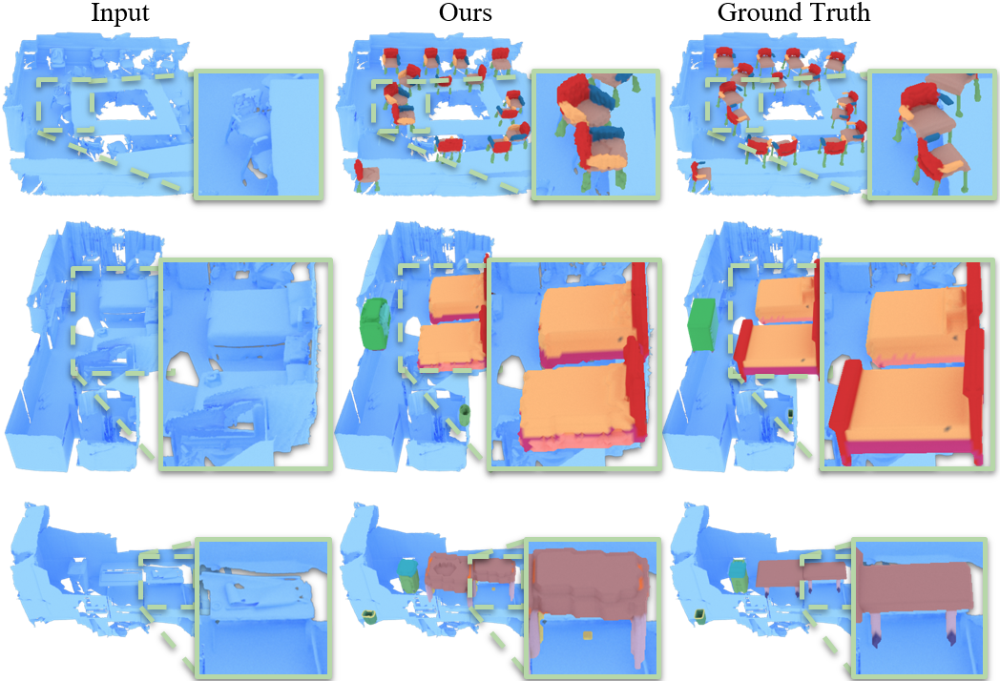

# Towards Part-Based Understanding of RGB-D Scans (CVPR 2021)

We propose the task of part-based scene understanding of real-world 3D environments: from an RGB-D scan of a scene, 
we detect objects, and for each object predict its decomposition into geometric part masks, which composed together 
form the complete geometry of the observed object.



[Download Paper (.pdf)](https://arxiv.org/pdf/2012.02094.pdf) 

## Demo samples



## Get started

The core of this repository is a network, which takes as input preprocessed scan voxel crops and produces voxelized part trees.
However, data preparation is very massive step before launching actual training and inference. That's why we release already prepared
data for training and checkpoint to perform inference. 
If you want to launch training with our data, please follow the steps below:

1. Clone repo: ```git clone https://github.com/alexeybokhovkin/part-based-scan-understanding.git```

2. Download data and/or checkpoint: \
   [ScanNet MLCVNet crops](xyz) \
   [PartNet GT trees](xyz) \
   [Parts priors](xyz) \
   [Checkpoint](xyz) 

3. For training, prepare augmented version of ScanNet crops with script ```dataproc/prepare_rot_aug_data.py```.
   After this, create a folder with all necessary dataset metadata using script ```dataproc/gather_all_shapes.py```

4. Create config file similar to ```configs/config_gnn_scannet_allshapes.yaml``` (you need to provide paths to some directories and files)

5. Launch training with ```train_gnn_scannet.py```

## Citation

If you use this framework please cite:

```
@article{Bokhovkin2020TowardsPU,
  title={Towards Part-Based Understanding of RGB-D Scans},
  author={Alexey Bokhovkin and V. Ishimtsev and Emil Bogomolov and D. Zorin and A. Artemov and Evgeny Burnaev and Angela Dai},
  journal={ArXiv},
  year={2020},
  volume={abs/2012.02094}
}
```